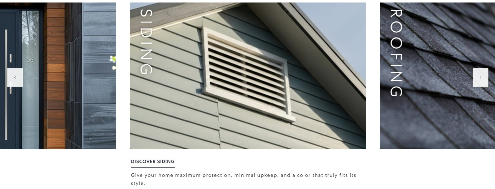
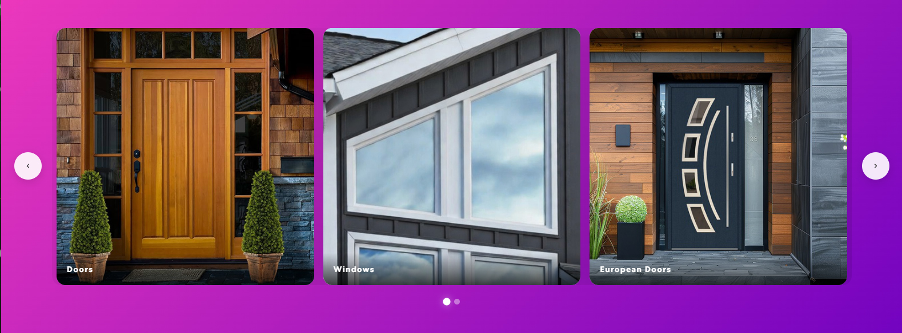
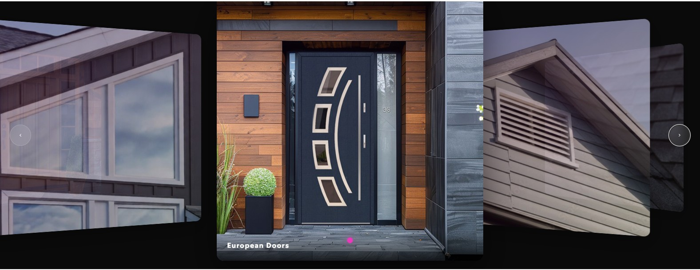
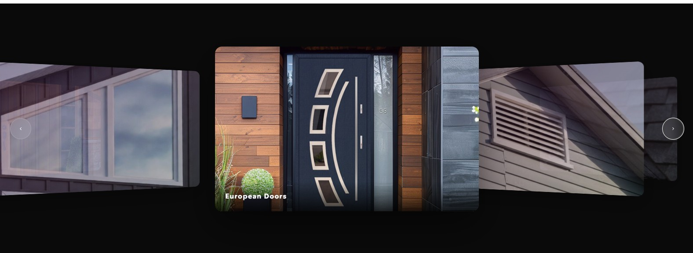

<p align="center">
  
</p>

<h1 align="center">XtremeSlider</h1>
<p align="center">A free, lightweight WordPress image slider plugin with four layout modes and zero external dependencies.</p>

<p align="center">
  
  
  
  
  
</p>

<p align="center">
  <a href="https://xtremeplugins.com/plugins/xtreme-slider"></a>
  &nbsp;&nbsp;
  <a href="https://xtremeplugins.com/plugins/xtreme-slider/donate"></a>
</p>

---

## Layouts

### Default — Editorial Full-Bleed
<p align="center"></p>

Full-bleed slider with peek effect, infinite looping, vertical title overlay, and caption below center slides.

### Cool — Gradient Cards
<p align="center"></p>

Card-based slider with customizable gradient background, rounded corners, hover lift, and pagination dots.

### 3D — Perspective Depth
<p align="center"></p>
<p align="center"></p>

CSS perspective slider with depth transforms, center slide prominent, adjacent slides rotated and scaled back, glassmorphism arrows. Per-slider background color picker.

### Options — Clickable Card Grid

Static grid of option cards (image + title + caption). Clicking a card reveals its own HTML content in a detail panel below — useful for product variants, plan comparisons, or any "pick one, see details" pattern. Each card's HTML is edited inline with Code / Preview tabs in the admin. Per-slider background color picker.

---

## Features

- Free mode: up to 2 sliders, 10 images per slider, and 1–6 visible slides
- Premium mode: unlimited sliders, 50 images per slider, and up to 15 visible slides
- Per-slide: title, caption, description, link URL (Options layout adds per-card HTML content)
- Image ratio: 16:10 (landscape), 1:1 (square), or Fixed Height (set pixel height, width scales to natural image proportions). Premium adds Default (original) ratio
- Autoplay with configurable speed (2–10s) and hover pause
- Fullscreen mode (100vw edge-to-edge)
- Touch/swipe support on all layouts
- Mouse drag navigation (Default layout)
- Square corners and black arrows display toggles
- Configurable link hover color, gradient background (Cool), and solid background color (3D, Options)
- Shortcode with per-instance overrides:
  ```
  [xtreme_slider id="5" layout="3d" visible="2" autoplay="true" fullscreen="true"]
  ```
- Conditional asset loading — CSS/JS only on pages with a slider
- Vanilla JavaScript frontend (~5KB), no jQuery

## Requirements

- WordPress 6.0+
- PHP 7.4+

## Installation

1. Download `xtreme-slider.zip` from [https://xtremeplugins.com/plugins/xtreme-slider](https://xtremeplugins.com/plugins/xtreme-slider)
2. Upload via **Plugins → Add New → Upload Plugin** or unzip to `/wp-content/plugins/`
3. Activate the plugin
4. Create a slider from the **Xtreme Slider** menu
5. Copy the shortcode and paste it into any page, post, or widget

## Compatibility

Works with Elementor, Gutenberg, Classic Editor, and any page builder that supports shortcodes.

## License

GPL-2.0-or-later — [https://www.gnu.org/licenses/gpl-2.0.html](https://www.gnu.org/licenses/gpl-2.0.html)

## Links

- [Plugin Page](https://xtremeplugins.com/plugins/xtreme-slider)
- [Download](https://xtremeplugins.com/src/zip/xtreme-slider.zip)
- [Changelog](CHANGELOG.md)
- [Report Issues](https://github.com/Xtreme-Plugins/xtreme-slider/issues)
